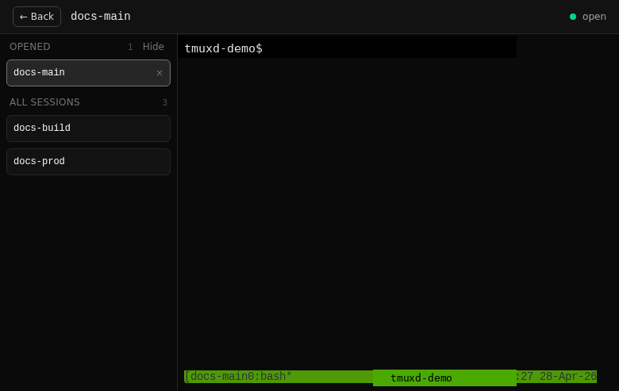
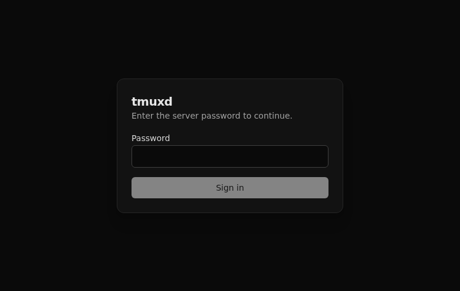
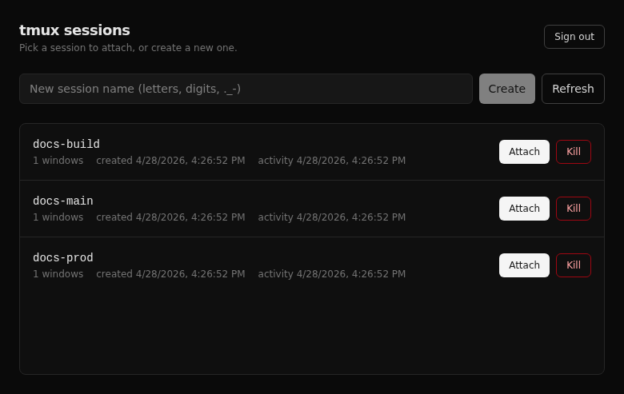
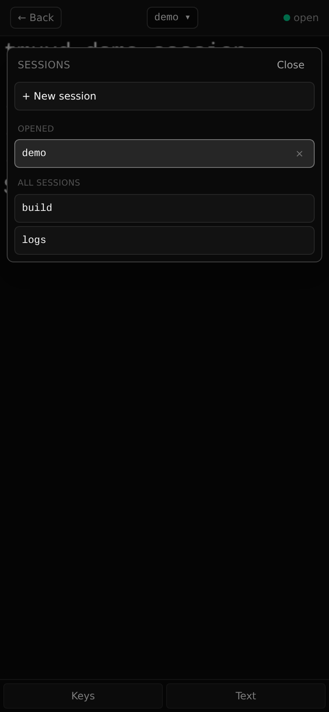

# tmuxd

A local-first web UI for `tmux` sessions. Open your browser, sign in with one shared token, and attach to existing tmux sessions with a full xterm terminal.



## What it does

- Lists all tmux sessions for the server user.
- Can route to outbound tmuxd clients on other boxes, so one page can show tmux sessions from multiple machines.
- Creates, attaches to, and kills tmux sessions from the web UI.
- Creates named sessions or auto-named sessions when you leave the name blank.
- Streams an interactive terminal over WebSocket using xterm.js.
- Saves pasted clipboard images to `~/.tmuxd/uploads` and pastes the saved file path into local sessions.
- Keeps a browser-local **Opened** list for fast switching between recently attached sessions.
- Provides an **Opened / All sessions** side panel on the terminal page, including a quick **New session** action.
- Starts newly-created sessions in the server user's home directory.
- Supports mobile layouts and install-to-home-screen PWA metadata.
- Adds mobile-friendly **Keys** and **Text** controls for special keys and selectable session text.
- Uses two-token login + short-lived JWTs for the API. Server token is the team trust circle; user token is your personal identity (the server hashes it into a namespace).
- Uses short-lived one-time WebSocket tickets instead of putting the long-lived JWT in the WebSocket URL.

## Screenshots

### Login



### Session list



### Terminal attach with centered title and side panel


### Mobile session picker



## Requirements

- Node.js 20+
- npm
- `tmux` on `PATH`
- Linux or macOS. `node-pty` requires a POSIX PTY.

## Quick start

```bash
npm install
cp .env.example .env
# edit .env and set TMUXD_SERVER_TOKEN
npm run build
npm start
```

The server prints a URL, usually `http://127.0.0.1:7681`.

**First time only**: generate a personal user token. This is your
permanent identity on this server — re-use the same value on every
device (laptop CLI, web UI, client processes) so they all land in the
same namespace.

```bash
npm run tmuxd -- login \
  --hub http://127.0.0.1:7681 \
  --server-token "$TMUXD_SERVER_TOKEN" \
  --user-token-generate
# stderr prints the generated token. Save it to a password manager.
```

Then open the web URL and sign in with the **server token** plus the
**same user token** you just generated. See
[docs/identity-model.md](docs/identity-model.md) for the trust model
rationale and [docs/deployment-modes.md](docs/deployment-modes.md) for
multi-user / client setups.

## Configuration

`tmuxd` reads `.env` from the project root. There are two templates:

- `.env.example` — for the **server** (the box running `npm start`)
- `.env.client.example` — for **client** boxes (the ones running `npm run client`)

The server has three deployment shapes (single-user local,
server+clients mixed, relay multi-user) — pick one before filling in
`.env`. See [docs/deployment-modes.md](docs/deployment-modes.md) for
the decision tree.

| Variable | Default | Description |
| --- | --- | --- |
| `TMUXD_SERVER_TOKEN` | required | Shared trust-circle token. Anyone with this can use the server. Pair it with a personal `TMUXD_USER_TOKEN` to identify *who* is using it. See [docs/identity-model.md](docs/identity-model.md). |
| `TMUXD_RELAY` | unset | When `1`/`true`, every local-tmux route returns 403 and the local host is hidden from `/api/hosts`. Recommended for multi-user deployments (relay mode). |
| `HOST` | `127.0.0.1` | Bind address. Use `0.0.0.0` only when you understand the network exposure. |
| `PORT` | `7681` | HTTP port. |
| `TMUXD_HOME` | `.tmuxd` in CWD | Directory for generated runtime secrets (e.g. `jwt-secret`). |
| `JWT_SECRET` | generated | Optional JWT signing secret. If set manually, it must be at least 32 bytes. Removing the persisted `jwt-secret` file revokes every outstanding JWT on next restart. |
| `TMUXD_TMUX_PATH` | `tmux` on PATH | Override the tmux binary the server / client invokes. Useful for non-standard tmux installs. |
| `TMUXD_AUDIT_DISABLE` | unset | When `1`, silences the structured audit log on stderr. Default behavior in production is on. |
| `TMUXD_USER_TOKEN` | (per-client) | Personal token used by the outbound client and the CLI. The server computes `namespace = sha256(userToken).slice(0, 16)` from it. **Not** read by the server itself; lives on each user's client device. |

Example `.env`:

```env
TMUXD_SERVER_TOKEN=replace-with-a-long-random-token
HOST=127.0.0.1
PORT=7681
```

Generate a strong server token:

```bash
openssl rand -base64 24
```

Generate a strong JWT secret if you want to manage it yourself:

```bash
openssl rand -base64 48
```

Generate a fresh user token from the CLI (run on your client device,
not the server — the user token is per-user, not per-deployment):

```bash
npm run tmuxd -- login --hub https://tmuxd.example.com \
  --server-token "$TMUXD_SERVER_TOKEN" --user-token-generate
```

## Server / client mode

By default, tmuxd controls tmux on the same machine as the web server. To show tmux sessions from other machines in the same web UI, run the normal server and start one outbound client per remote machine.

On the server:

```bash
TMUXD_SERVER_TOKEN=replace-with-a-long-random-token \
HOST=0.0.0.0 PORT=7681 npm start
```

On a client machine:

```bash
TMUXD_URL=http://tmuxd.example:7681 \
TMUXD_SERVER_TOKEN=replace-with-a-long-random-token \
TMUXD_USER_TOKEN=your-personal-user-token \
TMUXD_HOST_ID=workstation \
TMUXD_HOST_NAME=Workstation \
npm run client
```

You can also pass client options as flags:

```bash
npm run client -- \
  --hub http://tmuxd.example:7681 \
  --server-token replace-with-a-long-random-token \
  --user-token  your-personal-user-token \
  --host-id workstation --host-name Workstation
```

Notes:

- Clients make an outbound WebSocket connection to `/client/connect`; they do not open an inbound HTTP port.
- `TMUXD_HOST_ID` is the stable ID stored in browser workspaces and URLs. Use letters, digits, `.`, `_`, or `-`.
- `TMUXD_HOST_NAME` is just the display name in the UI.
- Clients authenticate via `?serverToken=…&userToken=…` query string on the WS upgrade. Authorization headers are not used because some intermediate proxies strip them on `Upgrade`.
- Same `TMUXD_HOST_ID` in two different namespaces (i.e. with two different user tokens) coexist as distinct records — Alice's `laptop` and Bob's `laptop` do not collide.
- Use HTTPS/WSS when the server is reachable beyond a private network.
- A connected client advertises capabilities to the server. Hosts with the `create` capability appear in New-session host pickers.

The home page, terminal sidebar, mobile picker, and split chooser group sessions by host. Existing local routes such as `/attach/main` still mean the server's `local/main`; remote sessions use `/attach/:hostId/:name`.

## Multi-user relay mode

For deployments where many users share a single tmuxd server and each
should only see their own tmux sessions, see
[docs/relay-deployment.md](docs/relay-deployment.md). The two-token
model means new users do not require any server-side configuration:

- Operator hands out the **server token** once.
- Each user picks (or generates) their own **user token**.
- The server hashes the user token into a 16-hex-char namespace; everyone's
  view is filtered to their namespace.
- `TMUXD_RELAY=1` to disable local-tmux routes entirely (the server
  becomes a proxy/router only — that's "relay mode").

Read [docs/identity-model.md](docs/identity-model.md) before deploying —
namespace is convention isolation, not authentication against people
who already hold the server token.

## Using the app

### Sign in

1. Visit the server URL.
2. Enter the **server token** from `.env` and your personal **user token**
   (the one printed by `tmuxd login --user-token-generate` on first-time
   setup — see Quick start).
3. Click **Sign in**.

### New session

On the sessions page:

1. Optionally enter a name using letters, digits, `.`, `_`, or `-`.
2. Choose the host next to the session name. It defaults to **Local** when available.
3. Click **New**.
4. If the name is blank, tmuxd creates an auto-named session such as `web-20260428-090507`.
5. Click **Attach** to open the terminal.

New sessions start in the selected host user's home directory.

### Attach and switch sessions

On the terminal page:

- The centered title shows the current session name.
- **Opened** shows sessions opened in this browser.
- **Opened** and **Not opened** are grouped by host.
- Session rows and workspace pane headers use a small status light: gray = connecting/unknown, green = read/normal, yellow = unread activity, red = closed/error.
- **New** creates a named or auto-named session on the selected host and attaches to it.
- Click any session name to switch.
- Click `×` next to an opened session to remove it from the browser-local list.
- Click **Hide** to collapse the side panel; click **Sessions** to show it again.

On mobile:

- Tap the session name in the top bar to open the session picker.
- Use **New** from the picker to create and attach to a new session.
- Use **Keys** for mobile-friendly terminal keys and modifiers.
- Use **Text** to open selectable tmux session text. The text view is positioned from tmux's current scroll position.
- Use **Image** when browser image paste is not available; it uploads an image file and pastes its path.
- Use **Actions** to create browser-local custom buttons that send predefined text to the active pane.

### Custom actions and timers

The terminal page has an **Actions** panel on desktop and mobile.

- Create custom actions with a short label and payload.
- Click an action to run its configured trigger against the active pane.
- Optional trigger settings can run an action immediately, after a delay, or at a local date/time.
- Optional timer settings can repeat an action every N seconds after the first trigger, with an optional repeat count.
- Timers are bound to the pane/session that was active when started.
- Timers stop when the pane closes, its target changes, the websocket closes/errors, or the page unloads.
- Starting a timer whose payload contains Enter/newline asks for confirmation because it may execute shell commands.

Custom actions are stored in the browser's localStorage. They are not synced between browsers and do not run in the background after the page is closed.

### Programmatic tmux API

Other local agents can use tmuxd as a JSON control plane for both **Local** and remote tmux hosts (registered via outbound clients). This mirrors the common `tmux` skill workflow: list panes, capture bounded scrollback, send literal text or special keys, and reuse named actions.

All endpoints require the normal web JWT:

```bash
TOKEN=$(curl -s http://127.0.0.1:7681/api/auth \
  -H 'content-type: application/json' \
  -d '{"token":"..."}' | jq -r .token)
```

Pane inspection:

```bash
# All panes on a host, optionally restricted to one session.
curl -H "Authorization: Bearer $TOKEN" \
  'http://127.0.0.1:7681/api/hosts/local/panes?session=main'

# Equivalent host-aware session helper.
curl -H "Authorization: Bearer $TOKEN" \
  'http://127.0.0.1:7681/api/hosts/local/sessions/main/panes'

# Capture the newest 120 joined lines from a pane target, retaining at most 64 KiB.
curl -H "Authorization: Bearer $TOKEN" \
  'http://127.0.0.1:7681/api/hosts/local/panes/main%3A0.0/capture?lines=120&maxBytes=65536'

# Stable tmux pane ids such as %7 can also be used; URL-encode % as %25.
curl -H "Authorization: Bearer $TOKEN" \
  'http://127.0.0.1:7681/api/hosts/local/panes/%257/capture?lines=80'

# Classify whether a pane looks idle, running, waiting for input, in a permission prompt, etc.
curl -H "Authorization: Bearer $TOKEN" \
  'http://127.0.0.1:7681/api/hosts/local/panes/main%3A0.0/status?lines=120&maxBytes=65536'

# Clear the sticky unread light after you have looked at the pane.
curl -X POST -H "Authorization: Bearer $TOKEN" \
  'http://127.0.0.1:7681/api/hosts/local/panes/main%3A0.0/activity/read'

# One aggregate snapshot for agents that need a quick inventory.
curl -H "Authorization: Bearer $TOKEN" \
  'http://127.0.0.1:7681/api/client/snapshot?capture=1&captureLimit=4'
```

Pane captures return `truncated` and `maxBytes`. When truncation is needed, tmuxd keeps the newest UTF-8-safe tail of the capture so status checks still see the latest prompt. Pane status responses also include a small sticky `activity` light: `green` = read/normal, `yellow` = unread output changed, `red` = tracked pane closed. Polling status does not clear unread; clear it explicitly with `POST /api/hosts/:hostId/panes/:target/activity/read`.

Input primitives:

```bash
# Literal text is sent with `tmux send-keys -l`; Enter is sent separately.
curl -X POST -H "Authorization: Bearer $TOKEN" -H 'content-type: application/json' \
  -d '{"text":"/status","enter":true}' \
  'http://127.0.0.1:7681/api/hosts/local/panes/main/input'

# Special tmux keys are validated and sent as argv, not through a shell.
curl -X POST -H "Authorization: Bearer $TOKEN" -H 'content-type: application/json' \
  -d '{"keys":["C-c","Enter"]}' \
  'http://127.0.0.1:7681/api/hosts/local/panes/main/keys'
```

Reusable server-side actions are stored in `TMUXD_HOME/actions.json`:

```bash
ACTION_ID=$(curl -s -X POST -H "Authorization: Bearer $TOKEN" -H 'content-type: application/json' \
  -d '{"label":"Status","kind":"send-text","payload":"/status","enter":true}' \
  http://127.0.0.1:7681/api/actions | jq -r .action.id)

curl -X POST -H "Authorization: Bearer $TOKEN" \
  "http://127.0.0.1:7681/api/hosts/local/panes/main/actions/$ACTION_ID/run"

curl -H "Authorization: Bearer $TOKEN" \
  'http://127.0.0.1:7681/api/actions/history?limit=20'
```

Remote hosts use the same routes with their host id, for example `/api/hosts/workstation/panes`. New tmuxd outbound clients advertise `panes` and `input` capabilities; older clients continue to work for session list/create/capture/attach but return `capability_not_supported` for these newer endpoints.

### Command-line client (`tmuxd`)

If you'd rather not hand-roll `curl` against the API, tmuxd ships a CLI that
mirrors the real `tmux` command grammar. Verbs and target syntax are the same
ones you already know — the only addition is `-t HOST:…` because tmuxd lives
above many tmux servers.

```bash
# One-time login. Two tokens: server (team trust) + user (your identity).
# First login on a new device — generate a fresh user token:
npm run tmuxd -- login --hub http://127.0.0.1:7681 \
  --server-token "$TMUXD_SERVER_TOKEN" \
  --user-token-generate

# Subsequent logins on the same identity (re-use the same user token):
npm run tmuxd -- login --hub https://tmuxd.example.com \
  --server-token "$TMUXD_SERVER_TOKEN" \
  --user-token  "$TMUXD_USER_TOKEN"

# Same verbs as tmux:
npm run tmuxd -- list-hosts
npm run tmuxd -- list-sessions -t laptop
npm run tmuxd -- new-session   -t laptop -s scratch
npm run tmuxd -- list-panes    -t laptop:scratch
npm run tmuxd -- capture-pane  -t laptop:scratch:0.0 --lines 80
npm run tmuxd -- send-text     -t laptop:scratch:0.0 --enter 'echo hi'
npm run tmuxd -- send-keys     -t laptop:scratch:0.0 C-c
npm run tmuxd -- pane-status   -t laptop:scratch:0.0   # state + light + summary
npm run tmuxd -- attach-session -t laptop:scratch      # prints web UI URL
npm run tmuxd -- kill-session  -t laptop:scratch
npm run tmuxd -- whoami
npm run tmuxd -- logout
```

Notes:

- `--server-token` and `--user-token` only appear on `login`; everything
  else reads the JWT from `~/.tmuxd/cli/credentials.json` (mode 0600).
  The CLI refuses to read the file if any group/world bit is set on it.
- File-based variants `--server-token-file <path>` and `--user-token-file <path>`
  also enforce mode 0600 on the file they read from.
- The `-t` flag follows tmux conventions: `-t host`, `-t host:session`,
  `-t host:session:0.0`, or `-t host:%paneId`.
- `--json` on any subcommand prints raw API JSON, suitable for piping to `jq`
  or driving from another agent.
- JWTs live for 12 hours. `tmuxd whoami` shows time-to-expiry; on 401 the CLI
  prints a one-line hint pointing at `tmuxd login` again. There is no silent
  re-auth.
- For a global install (`tmuxd ...` without `npm run`), see the bin entry in
  `server/package.json`.

### Clipboard images

When you paste an image into a **Local** terminal session, tmuxd saves it under `~/.tmuxd/uploads` on the server and pastes the shell-quoted file path into the terminal. This makes screenshots available to shell commands and terminal editors as normal files.

If your browser does not expose clipboard images to web pages, use the **Image** button in the terminal UI to choose an image file manually.

Remote client sessions do not currently receive pasted image files; only local sessions can use this clipboard-image path paste.

### Mobile / install as app

The web UI includes a web app manifest and icons.

- Android Chrome: menu → **Install app** or **Add to Home screen**.
- iPhone Safari: share button → **Add to Home Screen**.

Most browsers require HTTPS for full PWA install/service-worker behavior. Plain HTTP may only create a basic home-screen shortcut unless accessed from localhost.

## Security notes

This app controls a real shell through tmux. Treat access to tmuxd as access to the server user account.

Recommended deployment:

- Keep `HOST=127.0.0.1` and use SSH tunneling:

  ```bash
  ssh -L 7681:127.0.0.1:7681 user@server
  ```

- Or put tmuxd behind an HTTPS reverse proxy such as Caddy, nginx, or Cloudflare Tunnel.
- Use a long random token.
- If you run outbound clients, give every user their own user token; do not share user tokens across people.
- Restrict firewall/security-group access to trusted IPs.

Implemented safeguards:

- Token login with constant-time comparison.
- Short-lived API JWTs.
- Short-lived one-time WebSocket tickets.
- Session names are validated against `^[A-Za-z0-9._-]{1,64}$`.
- tmux commands use argv (`execFile` / `node-pty`), not shell interpolation.
- Login rate limiting.
- WebSocket Origin checks.
- WebSocket connection limits and idle timeout.
- API responses use `Cache-Control: no-store`.
- PTY child environment strips `TMUXD_SERVER_TOKEN`, `TMUXD_USER_TOKEN`, and `JWT_SECRET`.
- Browser JWTs are never forwarded to clients; the server talks to outbound clients over their own authenticated WebSocket channel.

## Development

Run server and Vite dev server together:

```bash
npm run dev
```

Run only the server:

```bash
npm run dev:server
```

Run only the web app:

```bash
npm run dev:web
```

Run an outbound client:

```bash
npm run client -- \
  --hub http://127.0.0.1:7681 \
  --server-token your-server-token \
  --user-token  your-user-token \
  --host-id dev-client \
  --host-name DevClient
```

## Validation

```bash
npm test
npm run typecheck
npm run build
npm run e2e
```

E2E coverage includes:

- Login success/failure.
- Authenticated session listing.
- New/duplicate/bad-name/delete session flows.
- New sessions starting in the server user's home directory.
- Session text capture from tmux scrollback.
- Programmatic pane list/capture/input APIs and server-side action CRUD/run flows.
- WebSocket attach, resize, ping/pong, input echo, UTF-8 roundtrip.
- Outbound-client remote host connect, remote session create/list/capture/delete, remote pane inspection/input, and remote WebSocket attach/input.
- Multi-client shared attach.
- Graceful shutdown with a live WebSocket.
- Production web build smoke test.

## Project structure

```text
server/   Hono HTTP API, WebSocket upgrade, tmux/PTY bridge, outbound client
shared/   TypeScript types and Zod schemas
web/      Vite + React + TanStack Router + xterm.js
scripts/  E2E validation scripts
```

## Troubleshooting

### Login says "Wrong tokens"

Both fields are required. The **server token** is the value after
`TMUXD_SERVER_TOKEN=` in the server's `.env` (not the variable name). The
**user token** is your own — generate one with `tmuxd login --user-token-generate`
the first time, then re-use the same value on every device that should
share your identity.

```bash
grep '^TMUXD_SERVER_TOKEN=' .env
```

### Cannot access from another machine

Check the bind address and firewall:

```bash
ss -ltnp | grep 7681
```

For external access, `HOST=0.0.0.0` listens on all interfaces, but you should use HTTPS or SSH tunneling for safety.

### `tmux` commands fail

Confirm tmux is installed and on PATH:

```bash
tmux -V
```

### WebSocket attach fails after leaving the tab open

Idle WebSocket sessions are closed after inactivity. Refresh or attach again.

## License

MIT
